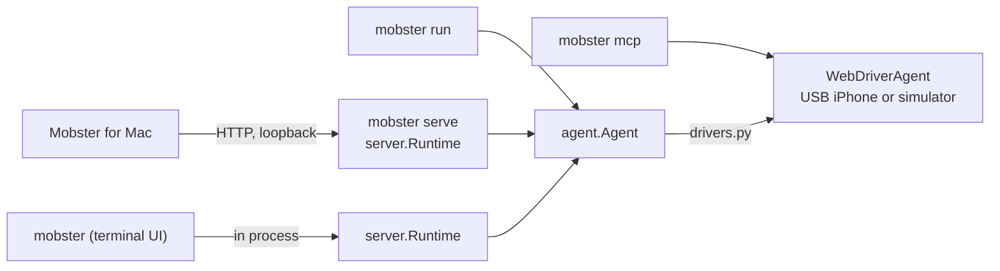

The full engineering notes, with every guard and speed path and the measurements behind them, are in [mobile_agent/docs/architecture.md](https://github.com/RadishSoftware/mobster/blob/main/mobile_agent/docs/architecture.md).

## The idea

A phone screen is built from labelled controls: buttons, cells, fields and switches, arranged in a tree. VoiceOver reads that tree aloud. Mobster reads the same tree, through WebDriverAgent, and decides what to do with a model that picks from the controls it was shown. It never makes up a control, and each step's decision can be checked before anything is sent to the phone.

A Quick mode step uses no screenshot, and Mobster's agent adds a small one. Reading the tree takes about 130–210 ms on an iPhone 15 Pro, and a whole Settings lookup about 8 s end to end. The cost is that Mobster cannot see what an app draws as pixels without labels, such as games, maps, canvases and text inside images.

## One task, step by step

```text
your task ─▶ compiled intent: known routes, multi-app plans, repeated-action loops
                 │
                 ▼
          ┌─ observe: read the accessibility tree, wait for the screen to settle ◀─┐
          │                                                                         │
          ▼                                                                         │
       decide: replay a recorded run, follow a route, or ask the model             │
          │                                                                         │
          ▼                                                                         │
       verify: stop gate, action check, duplicate guard, your approval,            │
               fresh-screen check                                                   │
          │                                                                         │
          ▼                                                                         │
       act: send it, record the outcome ────────────────────────────────────────────┘
          │  when the model says the goal is met
          ▼
       confirm on a fresh read, extract and verify any answer, report
```

1. **Observe.** The WDA driver (`drivers.py`) reads the tree and turns it into a `Snapshot` of elements with labels, roles, positions and values (`state.py`). It rebuilds what is visible from geometry, including what bars, keyboards and alerts cover. A step starts only once the screen has stopped changing.
2. **Decide.** The engine's model (`frontier.py` for Mobster's agent, `models.py` for Quick mode) gets the task and the elements and returns one typed decision: an operation (tap, type, scroll, submit, go back, open an app, done, blocked), its target element, how sure it is, how likely the goal is met, and how likely the task is blocked. Some steps need no model call at all: a recorded run replays on identical screens (`replay.py`), known routes navigate directly (`routes.py`), and exact repeats come from a memo (`decision_memo.py`).
3. **Verify.** Before anything is sent, the action passes a stop gate, an action check that compares the action's likely effect with the request, a ledger that refuses to repeat a side effect, your approval when one is needed, and a fresh read that refuses a decision made on a screen that has since changed (`agent.py`, `task_policy.py`, `effect_ledger.py`).
4. **Act.** The driver taps the element's coordinates or types into the field. Every action is written to the journal before it is sent (`journal.py`). An action whose outcome is unknown is never retried.
5. **Finish.** When the model says the goal is met, Mobster reads the screen again to confirm. If the task asked for an answer, the helper model extracts it, and every value must quote text that was on the screen (`extraction.py`). The result says how the run ended, and whether anything checked it independently.

## Three front ends, one runtime



One `server.Runtime` admits one task per phone, journals every event, holds approvals, applies Ask before acting and Bypass, and stops at safe points.

- **The terminal UI** (`tui/`) runs `server.Runtime` in its own process. A task is `Runtime.create`, its events are the run's event list, an approval is `Run.request_approval` answered with `Run.answer_approval`, and Stop is `Runtime.stop_run`. The UI only draws. `tui/session.py` is the thin layer between them and imports no UI library. `narrate.py` turns agent events into readable steps for both the UI and `mobster run`.
- **`mobster serve`** (`server.py`) puts the same `Runtime` behind a loopback HTTP API. The Mac app runs it as a bundled sidecar.
- **`mobster run`** (`__main__.py`) builds the agent directly for one task, with no journal and no approvals, which suits scripts.

Because the runtime is shared, a task behaves the same in all three: the same approval rules, the same limits, the same statuses and the same journal format.

## Where the code lives

| path | what it is |
| --- | --- |
| `mobile_agent/__main__.py` | the `mobster` command |
| `mobile_agent/tui/` | the terminal UI: `app.py` (Textual), `session.py` (the engine), `render.py`, `demo_phone.py` |
| `mobile_agent/narrate.py`, `console.py` | events as readable steps, and `run`'s terminal output |
| `mobile_agent/doctor.py`, `history.py`, `terminal_image.py` | `doctor`, `history` and `screen` |
| `mobile_agent/server.py` | `Runtime` and the HTTP API |
| `mobile_agent/agent.py` | the observe, decide, verify, act loop |
| `mobile_agent/drivers.py`, `state.py` | WebDriverAgent and the screen model |
| `mobile_agent/frontier.py`, `engines.py` | Mobster's agent (Smart) on your Claude or OpenAI key |
| `mobile_agent/models.py`, `helper_models.py`, `gemini.py` | Quick mode's model and its text helper |
| `mobile_agent/device_manager.py`, `setup_service.py` | building and supervising WDA on a USB iPhone |
| `mobile_agent/journal.py` | the crash-safe task journal and device locks |
| `mobile_agent/bench/`, `evals/` | MobsterBench-iOS, the iOSWorld runner and on-device evaluations |
| `mobile_agent/tests/` | the test suite: no phone, simulator or key needed |
| `docs/` | these pages |
| `mobile_agent/docs/` | dated design notes |

The Python package is named `mobile_agent`, and the distribution and command are `mobster-cli` and `mobster`. The package keeps its name on purpose. The Mac app launches it as `python -m mobile_agent` in development and freezes it by that name in its sidecar. Private extensions load as `mobile_agent.private`. The benchmarks, tests and design notes all name it. A rename would touch every one of those, and users would see no difference.

## Extensions

`extensions.py` loads an optional `mobile_agent.private` package when one is installed. That package can add device targets, command-line flags and runtime subclasses through a small set of hooks. The public package has no such package, so every hook stays empty and nothing changes.

## Data

A task sends its text and the screen's text to the engine's model, and Mobster's agent also sends a small screenshot of each step. A Quick mode task can send text and image crops to the text helper you configured. Keys stay in your env file. Journals stay on your Mac. Mobster has no server of its own.

## Why the terminal UI uses Textual

The UI is built with [Textual](https://textual.textualize.io/). It is Python, so it runs the agent's runtime in the same process with no extra server. Its widgets cover the prompt, lists and popups, and its test pilot drives the real app headlessly, which is how [the UI tests](https://github.com/RadishSoftware/mobster/blob/main/mobile_agent/tests/test_tui.py) and these screenshots work. It opens full screen, which keeps the phone view, the approval card and the status line in place while the transcript scrolls. The screenshot in the phone view is drawn by [textual-image](https://github.com/lnqs/textual-image), which asks the terminal what it can draw before the UI starts, and only where the environment names a terminal that shows images. The transcript summary it prints on exit keeps a record in scrollback. `mobster run` is the line-by-line alternative. The UI's first frame appears in about 0.3 s. Textual loads only when the UI opens, so `mobster serve`, `mobster run` and the Mac app never load it.
