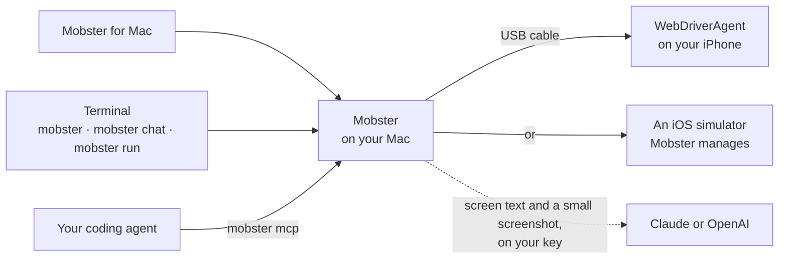
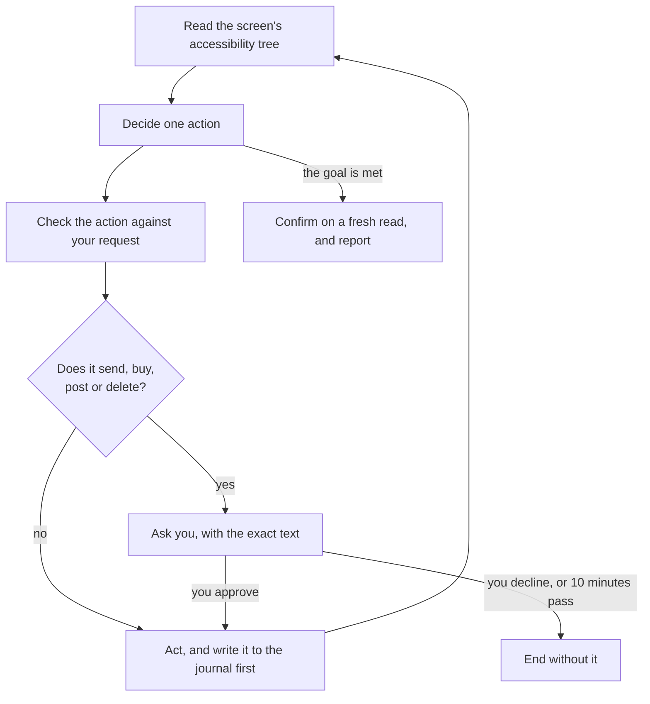

Mobster reads each screen of an iPhone as a list of labelled controls, the ones VoiceOver reads aloud, and acts on them by name: it taps "Send", reads "\$39.99 / year" as text, and knows a switch is on. It does this through a small test runner on the phone, over a USB cable from your Mac.

## How Mobster connects

Mobster for Mac, the terminal and your coding agent all reach the phone through Mobster on your Mac. Nothing goes through a Mobster server.

- **WebDriverAgent** is an open-source test runner, built on Apple's XCTest, that Xcode signs with your Apple Account and installs on the phone. The Mac app calls it **Mobster's helper**. It listens on the phone's own loopback, and Mobster reaches it over USB.
- **Your coding agent** drives the phone with its own model through `mobster mcp`, or hands a whole task to Mobster's agent with `phone_task`.
- **The model** sees only what Mobster's agent sends it, on your own key. A check's verdict never comes from a model.

## One task, step by step

1. **Read.** Mobster reads the screen's tree: labels, values, roles and state. A step starts only once the screen has stopped changing.
2. **Decide.** Mobster's agent picks one action on one control it was shown. It never makes up a control.
3. **Check.** Before anything reaches the phone, the action is compared with your request, a ledger refuses to repeat a side effect, and a fresh read refuses a decision made on a screen that has since changed.
4. **Approve.** A tap or submit that can send, buy, post, delete or submit waits for you. [Approvals and safety](/safety) has the rules.
5. **Act.** The action is written to the journal before it's sent, and an action whose outcome is unknown is never retried.
6. **Finish.** When the agent says the goal is met, Mobster reads the screen again to confirm. An answer must quote text that was on the screen.

[Architecture](/architecture) maps each step to the code.

## Words these docs use

| Word | What it means |
|---|---|
| Task | One request to Mobster's agent, such as "Turn on Dark Mode" |
| Conversation | Tasks that follow on from each other. A follow-up knows what earlier tasks found |
| Approval | The stop before an action that sends, buys, posts or deletes, until you answer |
| Mobster's agent | The agent built into Mobster. It runs on your Claude or OpenAI key. Flags and statuses call it `Smart` |
| Quick mode | A second engine for quick tasks in one app, on its own key. Flags and statuses call it `fast` |
| Workflow, schedule | A saved task, and a workflow that runs on a timer |
| Check | One file that says what must be true of your app after a flow, run by `mobster verify` or `mobster test` |
| Verdict | A check's result: `passed`, `failed`, `needs_review` or `couldnt_run`, decided from assertions on the tree |
| Run | One execution of a check or a task, with its own folder of frames and results |
| Accessibility tree | The labelled controls of a screen, as VoiceOver reads them |
| WebDriverAgent, Mobster's helper | The test runner on the iPhone that reads the tree and taps |
