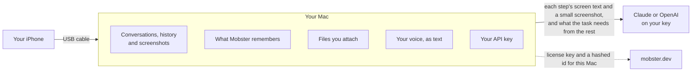

Mobster runs on your Mac. Your agent's commands go from your Mac to the phone over the cable, with no relay server and no Mobster account. Your screens go to a model only when Mobster's agent needs them, and only to the provider whose key you gave.

## What leaves your Mac

| What | Where it goes |
|---|---|
| Your agent's commands | From your Mac to the phone over USB. WebDriverAgent listens on the phone's loopback, reachable over USB only |
| Each step's screen text and a small screenshot | To your AI provider, when Mobster's agent runs the task |
| Your task, and what it needs from your conversation, memory and files | To your AI provider, with the task: at most 3,000 characters of the conversation, at most 12 things Mobster remembers, and what the agent reads from attached files |
| What a tool returns to an agent you connect over MCP | To that agent, and from it to its own model |
| Your voice | Nowhere: it becomes text on your Mac, and nothing is recorded |
| A license key and a hashed id for the Mac | To mobster.dev, from Mobster for Mac, to check the license and for updates. Never a screen, a task or anything from the phone |

There are no analytics and no crash reporting.

## What stays on your Mac

- **Conversations, history and their screenshots**, in Mobster's journal, readable only by you. Deleting a conversation deletes its tasks and their screens.
- **What Mobster remembers**, in your words, in one file readable only by you. Nothing is saved until you choose **Remember**, and it never remembers passwords, codes or card numbers. [Memory](/memory)
- **Files you attach.** A task sends only what it reads from them. A file you add and no task uses is deleted within a day. [Files](/files)
- **Your API key**, in the Mac app's env file or yours.

## Checks and coding agents

- A launch-only check, or a check your coding agent drives without a key, sends nothing anywhere.
- A check with steps sends each screen's image and accessibility text to the provider whose key it runs on.
- Runs from a real iPhone are written to Mobster's data folder unless you name another, so your phone's screens never land in a repository.

## Legal

The privacy policy and terms for Mobster for Mac are at [mobster.dev/privacy](https://mobster.dev/privacy) and [mobster.dev/terms](https://mobster.dev/terms).
